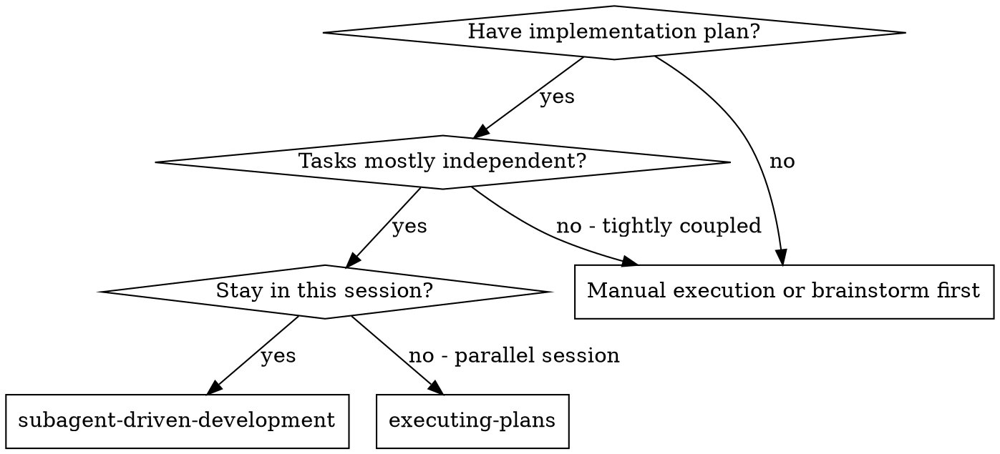

# Subagent-Driven Development

Execute plan by dispatching fresh subagent per task, with two-stage review after each: spec compliance review first, then code quality review.

**Core principle:** Fresh subagent per task + specialized persona + two-stage review (spec then quality) = high quality, fast iteration.

## When to Use



## The Process (Rigid Protocol)

For EACH task in the plan, you MUST follow this loop:

1.  **Read Plan**: Extract the full text, context, and requirements for the current task.
2.  **Dispatch Implementer**: 
    - Construct a **Mission Query** (see below).
    - **Interactive Confirmation**: Use `ask_user` with `type: 'yesno'` to confirm the assigned persona and mission parameters with the user.
    - Call the `implementer` agent with the query.
    - If the implementer asks questions, answer them before it begins.
3.  **Two-Stage Review Loop**:
    - **Stage A: Spec Compliance**: Call `spec-reviewer` with the **Review Mission**.
        - If ❌ Issues found: Send issues to `implementer`, wait for fixes, and **RE-REVIEW**.
        - Repeat until ✅ Spec compliant.
    - **Stage B: Code Quality**: Call `code-quality-reviewer` with the **Quality Mission**.
        - If ❌ Issues found: Send issues to `implementer`, wait for fixes, and **RE-REVIEW**.
        - Repeat until ✅ Approved.
4.  **Mark Complete**: Only after both reviews pass, mark the task as complete in your internal todo.
5.  **Next Task**: Move to Task N+1.

## 1. Constructing the Implementer Mission

When calling the `implementer` subagent, you MUST use this template:

```markdown
# MISSION PARAMETERS: TASK [N]

## 🎭 Assigned Persona
You are a **[Specialized Expert: e.g., Python Backend Engineer]**. Bring your deepest domain expertise to this task.

## 📝 Task Description
[PASTE FULL TEXT OF TASK FROM PLAN]

## 🏗️ Context & Dependencies
- **Project Goal**: [Summary]
- **Previous Work**: [What was just finished]
- **Constraints**: [e.g., Use library X, no new dependencies]

## 🛠️ Self-Review Checklist
You MUST complete this checklist before reporting back:
- [ ] Did I write a failing test BEFORE production code?
- [ ] Does the code match the spec exactly?
- [ ] Is the code idiomatic for a [Assigned Persona]?
```

## 2. Constructing the Review Missions

### Spec Reviewer Mission (Stage A)
```markdown
# REVIEW MISSION: SPEC COMPLIANCE

## What Was Requested
[FULL TEXT of task requirements]

## What Implementer Claims They Built
[Implementer's report summary]

## CRITICAL: Do Not Trust the Report
The implementer may be optimistic. You MUST:
1. Read the code in [File Paths]
2. Compare actual implementation to requirements line-by-line.
3. Check for missing requirements or unrequested "extra" features.
```

### Quality Reviewer Mission (Stage B)
```markdown
# REVIEW MISSION: CODE QUALITY

## Implementer Persona
[The persona assigned to the implementer]

## What Was Built
[Final implementation details]

## Your Job
Assess craftsmanship, security, performance, and testing. 
Check for:
- Proper error handling
- Naming clarity
- Test coverage (real tests, not mocks)
- Security risks
```

## Red Flags

**Never:**
- Call a subagent with a generic query.
- Skip the **Stage A -> Stage B** order (Spec must pass before Quality review).
- Skip the **Re-review** (if an issue is fixed, the reviewer MUST verify it).
- Let the implementer approve its own work.

## Integration

**Required workflow skills:**
- **superpowers:writing-plans** - Source of tasks.
- **superpowers:finishing-a-development-branch** - Finalizes the work after all tasks complete.
